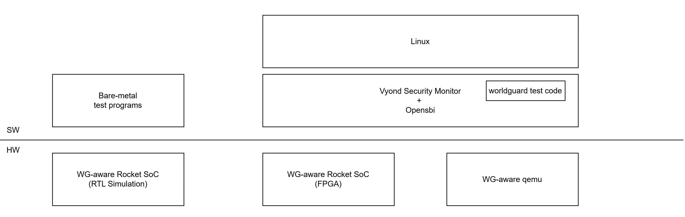

# Vyond

Vyond is a Secure OS working on RISC-V machine. The purpose of Vyond is to go beyond secure os, which originated from the word “Beyond”.
As of now, we open a Security Monitor (SM) of Vyond-TEE written in Rust and an implementation of SiFive's [WorldGuard](https://sifive.cdn.prismic.io/sifive/31b03c05-70fa-4dd8-bb06-127fdb4ba85a_WorldGuard-Technical-Paper_v2.4.pdf) running on [Chipyard](./chipyard-1.11.0/README.CHIPYARD.md).

## WorldGuard
WorldGuard (`WG`) is one of physical-memory isolation techniques used in RISC-V. This scheme provides a mechanism to tag transactions with an identification of the initiating context called a world id (`WID`) and reject illegal transactions if WID does not have a permission.
Vyond implements WorldGuard on top of Chipyard SoC generator framework so as to apply it to various RISC-V enabled SoC.

See more details in [WorldGuard on Chipyard](./chipyard-1.11.0/generators/worldguard/README.md) and [Initial Chipyard Setting](./chipyard-1.11.0/README.md)

## Vyond-TEE
Vyond provides an enclave as a protection domain isolated from the rest of the system, both in terms of its execution and its memory. 
Enclave is an isolated region of memory within the address space of a user-level process. This region of memory is controlled entirely by the Security Monitor.

See [Vyond Quick Start](./tee/README.md) to build and run Vyond-TEE.
