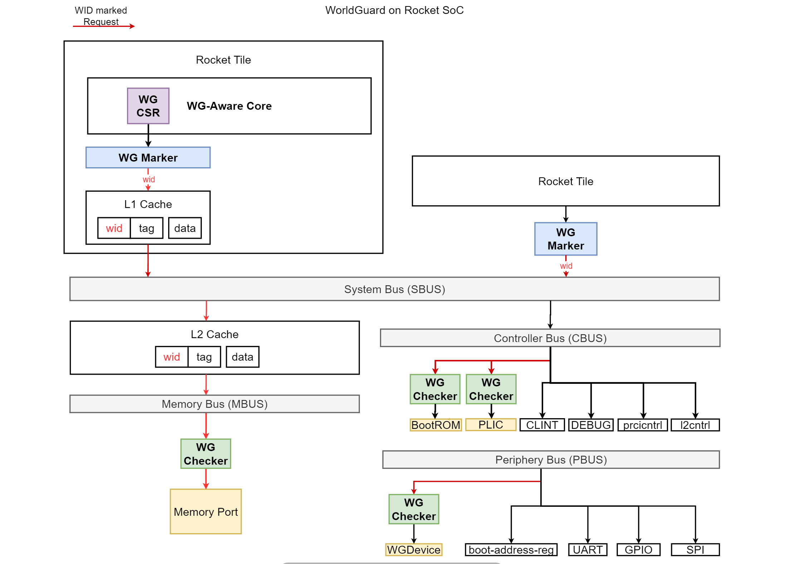

# WorldGuard on Chipyard
This repository implements [WorldGuard](https://sifive.cdn.prismic.io/sifive/31b03c05-70fa-4dd8-bb06-127fdb4ba85a_WorldGuard-Technical-Paper_v2.4.pdf) of SiFive on top of [Chipyard](../../README.CHIPYARD.md) SoC generator.
The goal of this work is to implement an independent and configurable worldguard generator so that it can work with almost any other generators.

It is NOT A SELF-RUNNING repository. To instantiate a WorldGuard, please use the customized [Chipyard](../../README.md) in this repository.

## 1. WorldGuard Quick Introduction



WorldGuard is one of physical-memory isolation techniques used in RISC-V. This scheme provides a mechanism to tag transactions with an identification of the initiating context called a world id (`WID`) and reject illegal transactions if `WID` does not have a permission. 
### 1.1 WorldGuard Marker (WGM)
A `WGM` is placed after a source that is usually `non-WorldGuard-aware` core. The `WGM` holds the current `WID` and marks a request transaction created by the source using `WID`. 


### 1.2 WorldGuard Checker (WGC)
A `WGC` is used to reject illegal transaction and placed before a target such as a periphery, a controller, or memory. The `WGC` has `PMP-like` memory-mapped register slots to hols memory ranges along with access permissions for each `WID`.
If a incoming transaction message marked with a `WID` does not have a permission to access memory range mapped to the target, the attached `WGC` responds with zero data instead of forwarding to the target.
Upon an illegal transaction, `WGC` can raise an interrupt or a response with a bus error flag expecting for `WorldGuard-aware` core to raise an illegal instruction exception, or both.

### 1.3 WG-Aware Core
A WG-Aware Core integrates `WGM` with additional internal registers and CSRs so that different privilege modes use different WIDs.
#### nWorlds
`nWorlds` holds the total number `WIDs` the core can use.
#### mwid
`mwid` is a trusted WID used to mark a transaction created by M-mode. With `mwid`, you can access to config registers of all WG components.

$$
\text{mwid} = \text{nWorlds} - 1
$$

#### mwidlist
The `mwidlist` determines the WIDs the core wgMarker can be assigned to, except for `mwid`.

$$
\text{mwidlist} =  \\{ \text{x} \in \text{Z} \mid \text{x} < \text{mwid} \\}
$$

#### mlwid
The `mlwid` is used to mark a transaction created by S-mode. It must be one of `mwidlist`.

$$
\text{mlwid} \in \text{mwidlist}
$$

#### mwiddeleg
The `mwiddeleg` holds wids that can be used to mark a transaction created by U-mode. `mwiddeleg` must not hold `mwid` and `mlwid`. One of `mwiddeleg` will be loaded to `slmwid`.

$$
\text{mwiddeleg} \in \text{mwidlist} \setminus \\{\text{mlwid}\\}
$$ 

#### slwid
The `slwid` is used to mark a transaction created by u-mode. It must be one of `mwiddeleg`.

$$
\text{slwid} \in \text{mwiddeleg}
$$

### 1.4 Cache extension for tagging wid.
To isolate cacheable device such as DRAM, caches must be wg-aware and include the `WID` in the cache line metadata. Tag for each cacheline is extended to store `WID`.
If the address match but the `WID` does not, then the line is evicted and the request is handled as a cache miss.

## 2. Supporting Features
- Generators of WorldGuard Marker (`WGM`) , Checker (`WGC`).
- WG-Aware Core with extended L1 and L2 Caches for tagging wid.
- Example Traits for Masters (e.g., Rocket Core) to create a `WGM` and place in between Master and an associated Bus.
- Example Traits for Slaves (e.g., Plic) to create a `WGC` and place in between Slave and an associated Bus.
- Configs to enable and set parameters of WGM, WGC, WG-Aware Core, and L1/L2 Caches.


## 3. How to Use
## Quick Start Guide
### Running test programs on RTL Simulation
```sh
cd $VYOND_ROOT/chipyard-1.11.0/sims/verilator
make CONFIG=WGRocketConfig run-binary-debug BINARY=../../generators/worldguard/tests/sims/src/read_unauthorized_cacheline1.riscv
```

[!NOTE] 
The chipyard v.1.11.0 employs the verilator v5.0.20 which has a issue with debug run. You need to manually install the newer version (e.g., v.5.024) when enabling debug mode is necessary.

### Generate a bitstream for VCU118 FPGA
```sh
cd $VYOND_ROOT/chipyard-1.11.0/fpga
make SUB_PROJECT=wgvcu118  bitstream
```
Read [this](https://chipyard.readthedocs.io/en/stable/Prototyping/VCU118.html) to setup the FAPGA board and flash the bitstream


## 4. WorldGuard Test 
Read [./test/README](./tests/README.md)

## 5. Design Details
Please refer to the following pages for design details.
- [Design details](./docs/Design.md)
- [WG Registers](./docs/Registers.md)
- [WGC, WGM Traits](./docs/Traits.md)
