# WorldGuard-Aware Rocket Core

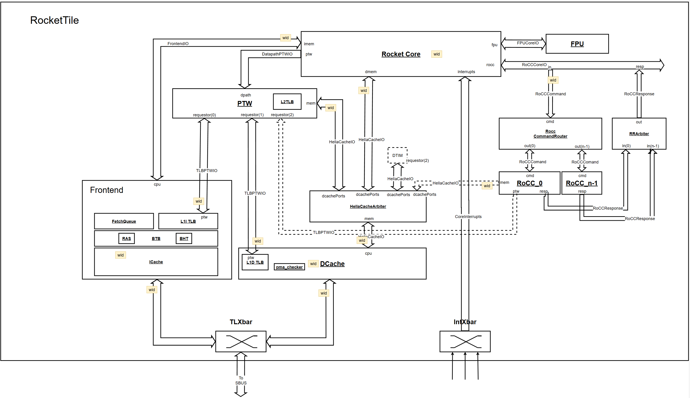

# WorldGuard-Aware L2 Cache

## Overall View
The following Figure shows the datapath of L2 Cache. Some modules are extended to store and forward `wid`. 
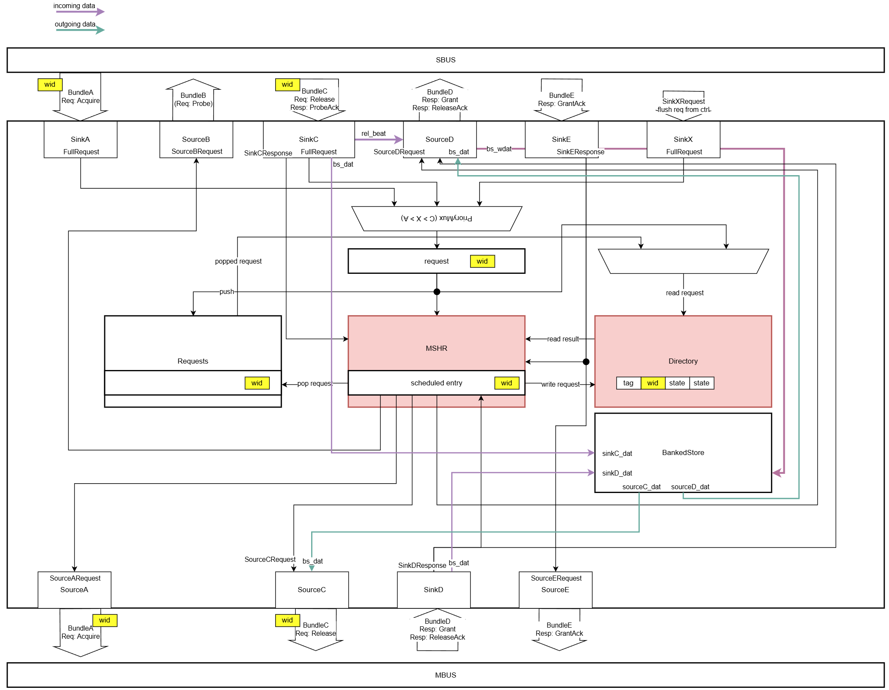

### Directory
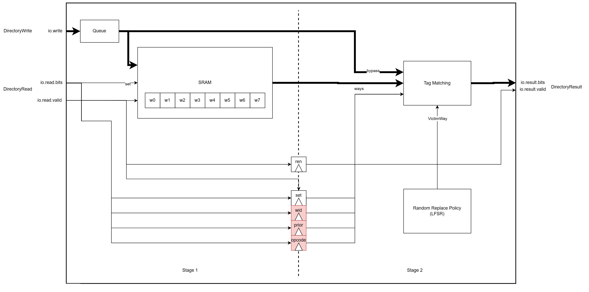

### TAG and WID matching
WGAware L2 Cache checks both tag and wid during the directory lookup. If the tag is matched but not wid, wgaware l2 cache considers it as a miss and the corresponding cache block will be invalidated. The following table summarizes the hit and miss case.

| hit | onlyTagHit| bypassHit | bypassOnlyTagHit | wayMatch | result.bits               | result.bits.hit   | result.bits.hit_wid   | result.bits.wid           | result.bits.way       |
|--   |--         |--         | --               | --       | --                        | --                | --                    | --                        | --                    |
| X   | X         | 0         |1                 | 0        | ways(victimWay)           | 0                 | 0                     | wid                       | victimWay             |
| X   | X         | 1         |1                 | 1        | bypass.data               | 0                 | 0                     | wid                       | victimWay             |
| X   | X         | 0         |1                 | X        | bypass.data               | bypassHit         | bypassOnlyTagHit      | bypass.data.wid           | bypass.way            |
| X   | X         | 1         |1                 | X        | bypass.data               | bypassHit         | bypassOnlyTagHit      | wid                       | bypass.way            |
| 0   | 1         | X         |0                 | X        | Mux1H(onlyTagHits, ways)  | hit               | onlyTagHit            | Mux1H(onlyTagHits, ways)  | OHToUInt(onlyTagHits) |
| 1   | 1         | X         |0                 | X        | Mux1H(hits, ways)         | hit               | onlyTagHit            | wid                       | OHToUInt(hits)        |

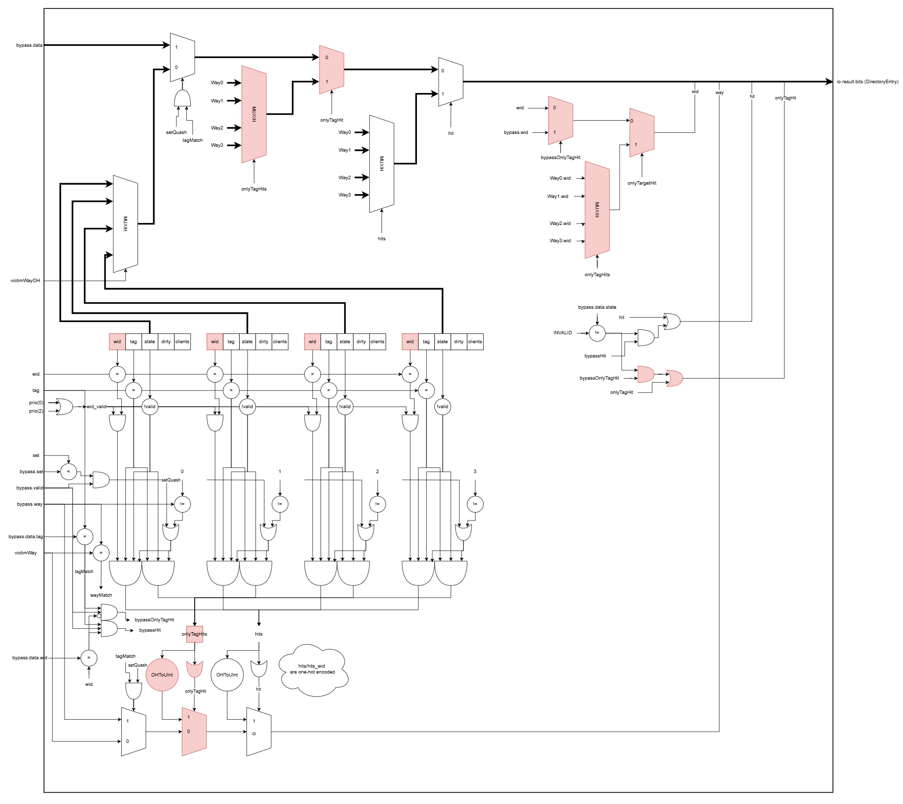

### Example Transactions on Access with different WID

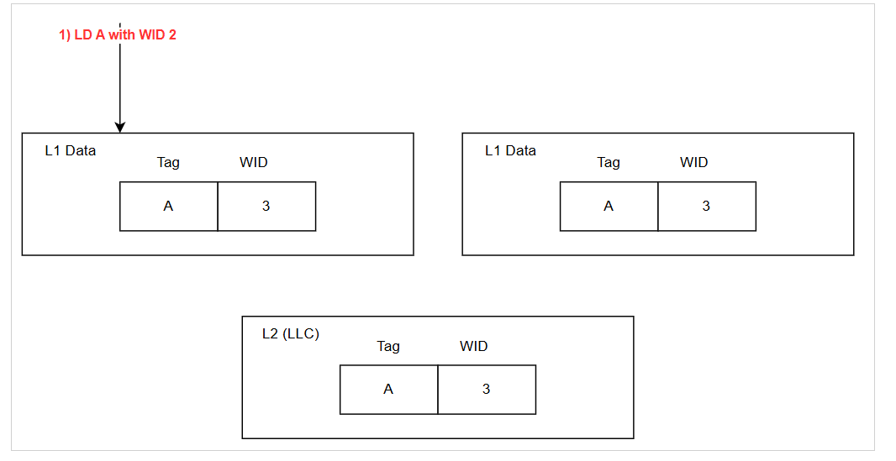
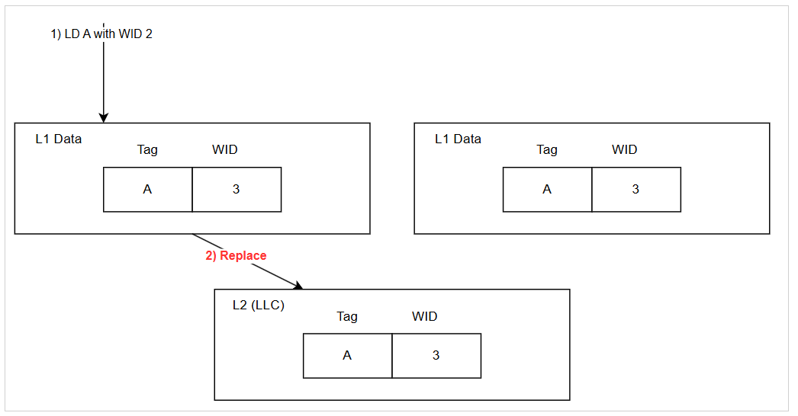
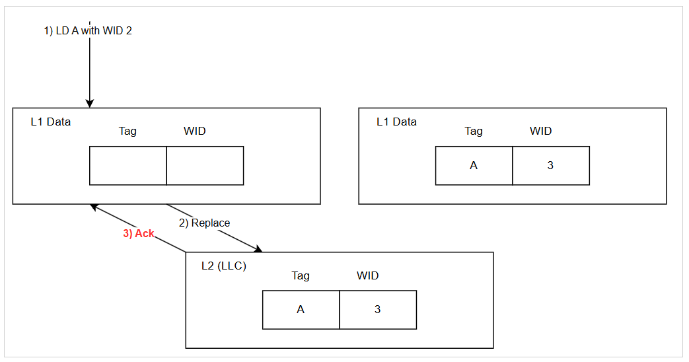
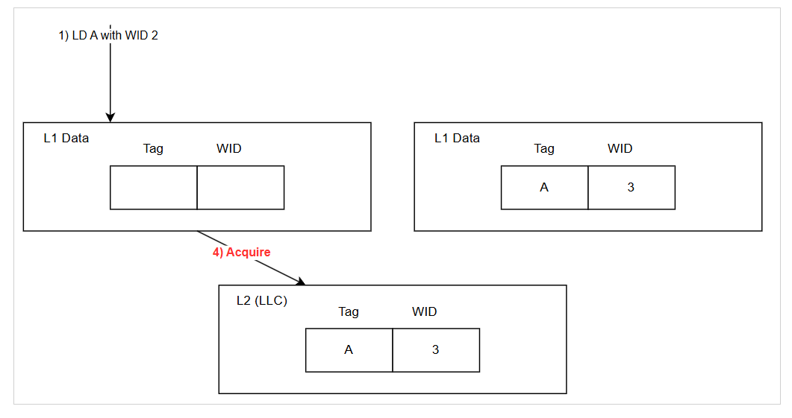
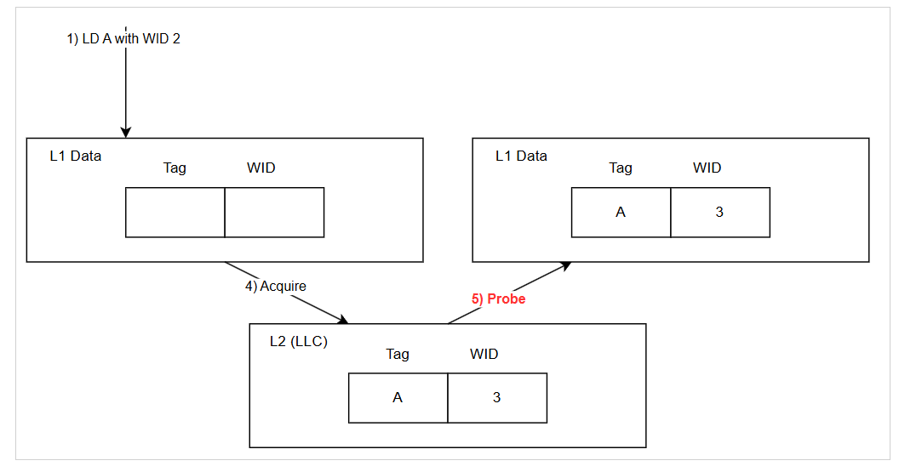
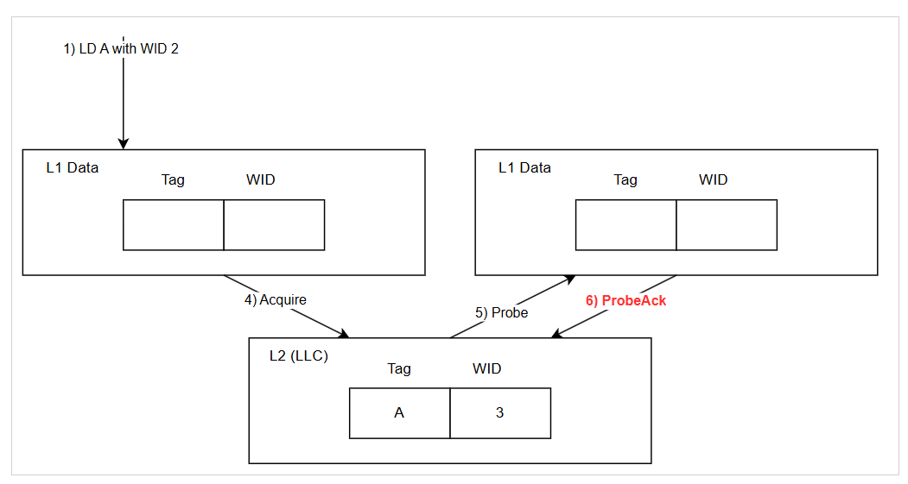
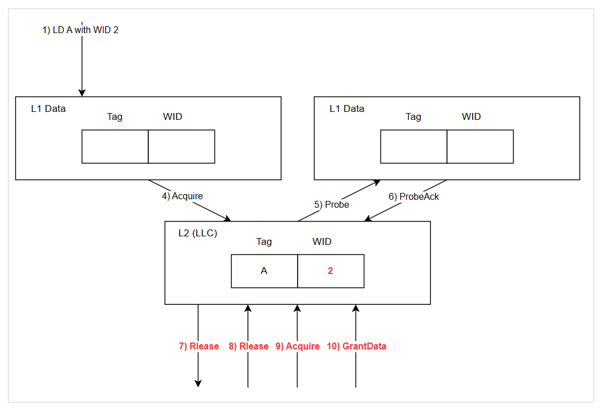
